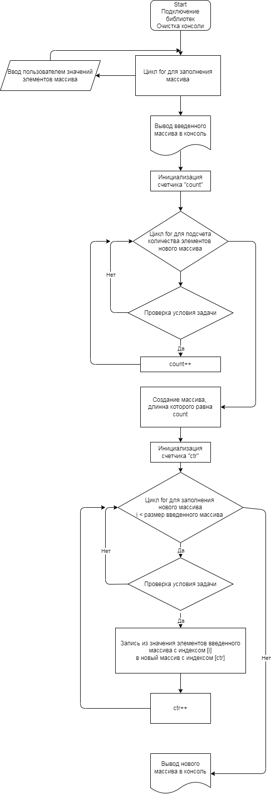

# Итоговая проверочная работа.

## Задача:

Написать программу, которая из имеющегося массива строк формирует массив из строк, длинна которых меньше или равна 3 символа. Первоначальный массив можно ввести с клавиатуры, либо задать на старте выполнения алгоритма. При решении не рекомендуется пользоваться коллекциями, лучше обойтись исключительно массивами.

## Алгоритм решения:

1. Создан массив из пяти строк.
2. Реализован метод создания нового массива с отсевом элементов, длинна которых более трех символов.
3. Использован метод вывода массива в консоль.

## Описание метода создания нового массива:

1. Для определения длинны нового массива использован счетчик (переменная "count").
2. Первым циклом "for" получаем количество подходящих по параметрам элементов и записываем это значение в "count".
3. Создаем новый массив размером равным "count".
4. Так как размеры первого и нового массива могут быть разными необходимо добавить новый счетчик ("ctr") для перебора элементов нового массива.
5. Второй цикл "for" используем для отсева неподходящих элементов. И если элемент подходит по условиям задачи, то записываем значение из первого массива в новый и увеличиваем значение счетчика "ctr" на 1.
6. Возвращаем новый массив из метода.

## Блок-схема:

